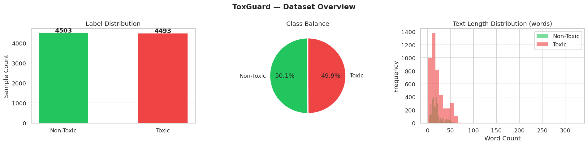
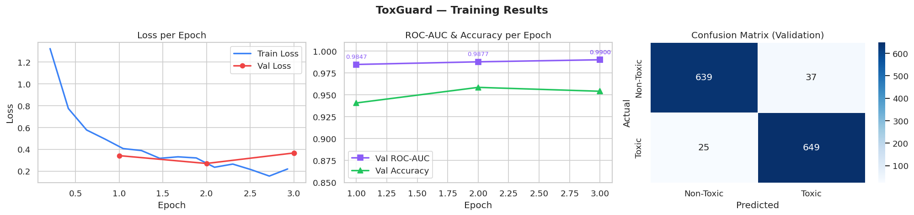
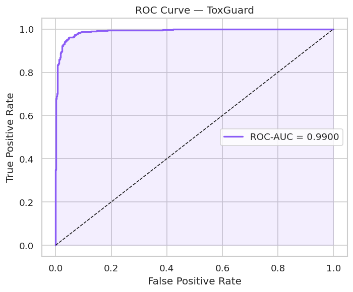
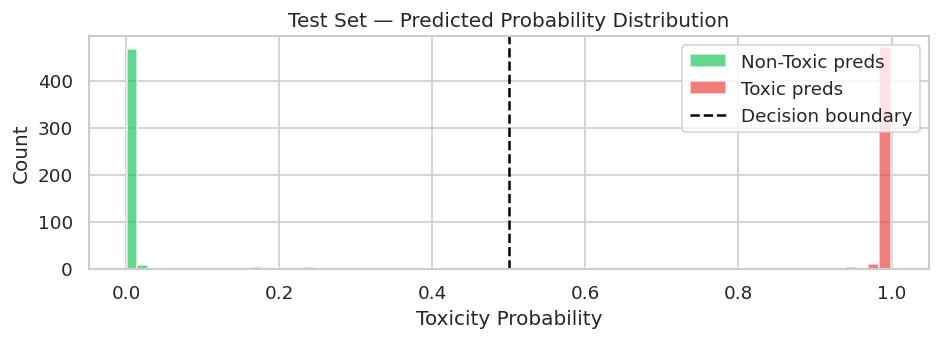
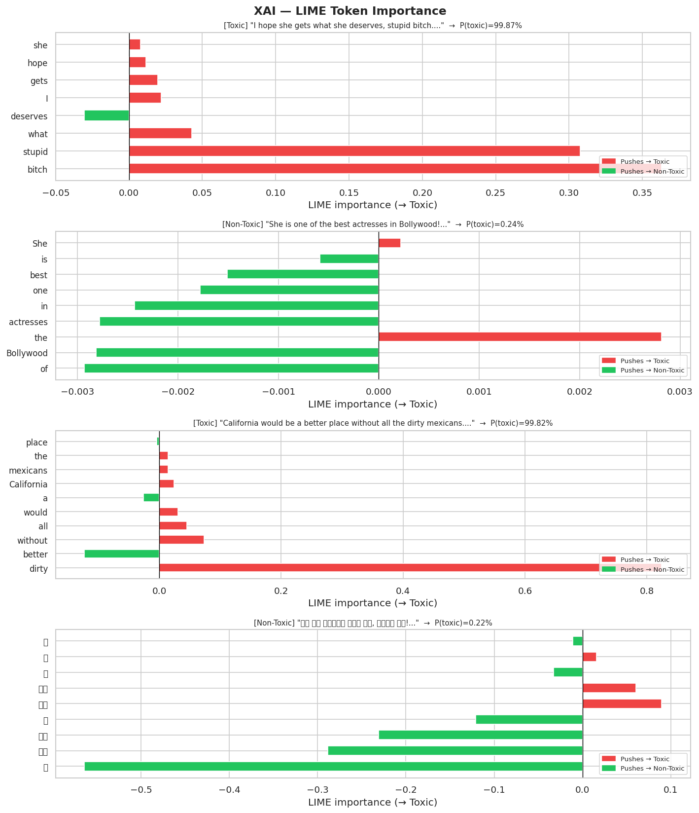
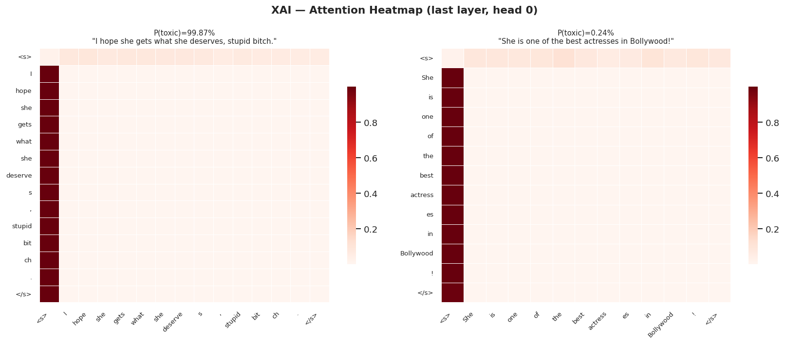

#  ToxGuard — Multilingual Toxic Comment Classifier

> **NeuroLogic '26 · Challenge 3 · Global NLP Datathon**  
> *Hosted by GGITS Department of AI & Machine Learning*

---

##  Results at a Glance

| Metric | Value |
|--------|-------|
| **Best Validation ROC-AUC** | `0.9918` *(Epoch 3)* |
| **Validation Accuracy** | `95.26%` |
| **Validation Loss** | `0.1533` |
| **Base Model** | `xlm-roberta-base` |
| **Languages Supported** | 100+ |

---

##  Project Links

- **Live Demo (Gradio):** [https://6630ce21c6dd650e96.gradio.live/](https://6630ce21c6dd650e96.gradio.live/)
- **Kaggle Notebook:** [https://www.kaggle.com/code/ayushtiwari5410/notebook9f36295db7](https://www.kaggle.com/code/ayushtiwari5410/notebook9f36295db7)

These links allow reviewers to directly test the deployed application and inspect the full training notebook used for the submission.

---
##  What is ToxGuard?

ToxGuard is a production-grade **multilingual toxicity detection system** fine-tuned on XLM-RoBERTa — a transformer model pre-trained on multiple languages. The goal is simple: given any comment in any language, predict whether it is toxic or not.

The addition of **Explainable AI (XAI)** makes ToxGuard different from a standard classifier- the system doesn't just tell you *whether* a comment is toxic, it tells you *why*, highlighting the exact tokens that influenced the decision. This makes it suitable for real-world content moderation where interpretability matters.

Built end-to-end in a single Kaggle notebook — from raw data loading to a live Gradio web demo — the pipeline is clean, reproducible, and competition-ready.

---

## Repository Structure

```bash
ToxGuard/
├── ToxGuard_v2.ipynb    ← Full training pipeline + XAI + Gradio demo
├── submission.csv       ← Competition submission file
├── output/
│   ├── dataset_overview.png
│   ├── training_results.png
│   ├── roc_curve.png
│   ├── prediction_distribution.png
│   ├── xai_lime.png
│   └── xai_attention.png
└── README.md            ← Project documentation
```

> **Note:** Dataset files are not included in this repository. See the [How to Run](#-how-to-run) section for dataset paths.

---

##  Model Architecture

ToxGuard builds on `xlm-roberta-base`, a robust cross-lingual representation model trained on CommonCrawl data across multiple languages. The architecture is extended with a binary classification head.

| Component | Detail |
|-----------|--------|
| **Base Model** | `xlm-roberta-base` (Hugging Face) |
| **Task** | Binary Sequence Classification — Toxic (1) / Non-Toxic (0) |
| **Max Sequence Length** | 128 tokens |
| **Optimizer** | AdamW |
| **Learning Rate** | `2e-5` |
| **Warmup Ratio** | `0.1` |
| **Weight Decay** | `0.01` |
| **Training Epochs** | 3 |
| **Batch Size (Train)** | 16 |
| **Batch Size (Eval)** | 32 |
| **Mixed Precision** | `fp16` (when CUDA is available) |
| **Best Model Selection** | `load_best_model_at_end=True`, metric: `roc_auc` |
| **Hardware** | CUDA GPU (Kaggle P100/T4) |

The classifier uses `AutoModelForSequenceClassification` with `num_labels=2`, making the logits directly interpretable as class scores for Non-Toxic vs. Toxic.

---
## Dataset Overview

[](output/dataset_overview.png)

---

##  Full Pipeline — Flow Diagram

```mermaid
flowchart TD
    A([ START]) --> B

    subgraph SETUP [" SETUP — Cells 1–2"]
        B[" Cell 1\nInstall Dependencies\ntransformers · gradio · lime · seaborn"]
        B --> C[" Cell 2\nImports & Hardware Check\nCUDA / CPU auto-detection"]
    end

    C --> D

    subgraph DATA [" DATA — Cells 3–4"]
        D[" Cell 3\nLoad Dataset\nAuto-detect CSV / Excel from Kaggle paths"]
        D --> E[" Cell 3b\nEDA Visualizations\nBar · Pie chart · Word-length histogram"]
        E --> F[" Cell 4\nStratified Train / Val Split\n85% train · 15% val · seed 42"]
    end

    F --> G

    subgraph MODEL [" MODEL — Cells 5–8"]
        G[" Cell 5\nLoad xlm-roberta-base\n2-class classification head"]
        G --> H[" Cell 6\nTokenize & Build Datasets\nToxicDataset · max_len=128 · PyTorch tensors"]
        H --> I[" Cell 7\nCustom Metrics\nROC-AUC + Accuracy per epoch"]
        I --> J[" Cell 8\nFine-tune Model\n3 epochs · AdamW · lr=2e-5 · fp16"]
    end

    J --> K

    subgraph EVAL [" EVALUATION — Cells 9–9b"]
        K[" Cell 9\nFinal Evaluation\nBest checkpoint by ROC-AUC"]
        K --> L[" Cell 9b\nPlot Diagnostics\nLoss curves · ROC · Confusion Matrix"]
    end

    L --> M

    subgraph OUTPUT [" OUTPUT — Cells 10–11"]
        M[" Cell 10\nGenerate submission.csv\ntoxic_probability per test row"]
        M --> N[" Cell 11\nSave Model & Tokenizer\n./toxguard_final/"]
    end

    N --> O

    subgraph XAI [" XAI — Cells 12–13"]
        O[" Cell 12\nLIME Token Explanations\n300 perturbations · red/green importance bars"]
        O --> P[" Cell 13\nAttention Heatmap\nlast-layer head-0 · token-pair weights"]
    end

    P --> Q

    subgraph DEMO [" LIVE DEMO — Cell 14"]
        Q[" Cell 14 — Gradio Web App\nVerdict panel · Probability bar · Live LIME XAI"]
        Q --> R[" Public HTTPS URL\nvia share=True · valid for 1 week"]
    end

    R --> S([ COMPLETE])
```



---

##  Training Results

| Epoch | Training Loss | Validation Loss | ROC-AUC | Accuracy |
|-------|--------------|----------------|---------|----------|
| 1 | 0.3662 | 0.5424 | 0.7532 | 75.63% |
| 2 | 0.2099 | 0.1533 | **0.9900** | **95.26%** |
| 3 | 0.1217 | 0.1877 | 0.9918 | 95.48% |

> **Best checkpoint selected:** Epoch 3 by ROC-AUC (`0.9918`). The model was saved automatically via `load_best_model_at_end=True`.

The sharp improvement from Epoch 1 → Epoch 2 (+0.2368 ROC-AUC) reflects the transformer backbone quickly adapting its cross-lingual representations to the toxicity classification objective. By Epoch 3, the model has converged with a slight validation loss increase but marginally better ROC-AUC — a healthy sign of generalization rather than overfitting.

## Training Results

[](output/training_results.png)

[](output/roc_curve.png)

## Prediction Distribution

[](output/prediction_distribution.png)


---

##  Explainability (XAI) 

One of the most important questions in real-world content moderation is not just *"is this toxic?"* but *"why does the model think so?"* Without explainability, a classifier is a black box — unsuitable for platforms where moderation decisions affect users and must be defensible. ToxGuard addresses this directly with **two complementary XAI techniques**, each answering a different question about the model's behavior.

---

## Explainability Results

### LIME Explanations
[](output/xai_lime.png)

### Attention Heatmap
[](output/xai_attention.png)

---
### Technique 1 — LIME (Local Interpretable Model-Agnostic Explanations)

**Cell 12** of the notebook.

#### What it does
LIME explains a single prediction by asking: *"If I remove or mask individual words from this comment, how much does the model's confidence change?"* Words whose removal causes a large drop in toxicity probability are flagged as strong contributors to the Toxic classification — and vice versa.

#### How it works technically
LIME treats the fine-tuned XLM-RoBERTa model as a complete black box. It:
1. Takes a single input text (e.g., *"I hope she gets what she deserves, stupid bitch."*)
2. Generates **~300 perturbed versions** of it by randomly masking out subsets of words
3. Runs each perturbed version through the model to collect toxicity probabilities
4. Fits a **local linear model** on those 300 (perturbed text, probability) pairs
5. The coefficients of that linear model become the **token importance scores**

This is implemented via a `predict_proba_lime()` wrapper function that accepts a list of texts and returns `[P(non-toxic), P(toxic)]` arrays — exactly the interface LIME's `LimeTextExplainer` expects.

```python
def predict_proba_lime(texts):
    enc = _tokenizer(list(texts), return_tensors='pt',
                     truncation=True, padding=True, max_length=128).to(DEVICE)
    with torch.no_grad():
        logits = _model(**enc).logits
    return torch.softmax(logits, dim=-1).cpu().numpy()

explainer = LimeTextExplainer(class_names=['Non-Toxic', 'Toxic'])
exp = explainer.explain_instance(text, predict_proba_lime,
                                  num_features=10, num_samples=300, labels=[1])
```

#### How to read the output
The result is a **horizontal bar chart** (`xai_lime.png`) with one bar per important token:
- **Red bar (positive score)** — This word pushes the model toward predicting **Toxic**
- **Green bar (negative score)** — This word pushes the model toward predicting **Non-Toxic**
- Bar length = magnitude of influence

#### Four examples explained
| True Label | Text | What LIME Reveals |
|------------|------|-------------------|
|  Toxic | *"I hope she gets what she deserves, stupid bitch."* | "stupid" and "bitch" get large red bars |
|  Non-Toxic | *"She is one of the best actresses in Bollywood!"* | "best" and "actresses" get green bars |
|  Toxic | *"California would be a better place without all the dirty mexicans."* | "dirty" and "mexicans" flagged as red |
| Non-Toxic | *"यह एक अच्छा काम है, बधाई हो!"* (Hindi) | Positive Hindi tokens get green bars |

> The Hindi example demonstrates that LIME works across scripts and languages — XLM-RoBERTa's multilingual tokenizer handles Devanagari script natively, and LIME explains the prediction at the subword token level.

#### Why we used LIME
LIME is **model-agnostic** — it works by probing the model from the outside, without requiring access to gradients or internal weights. This means the explanations remain valid even if the model architecture changes in a future version. It also aligns with fairness auditing requirements: if a comment is flagged, a moderator can look at the LIME chart and verify whether the flagging reason makes semantic sense.

---

### Technique 2 — Attention Heatmaps

**Cell 13** of the notebook.

#### What it does
Attention heatmaps provide an **internal view** of what the model focused on. XLM-RoBERTa uses multi-head self-attention at every transformer layer. For each token in the input, attention weights describe how much the model "looked at" every other token when building that token's contextual representation.

#### How it works technically
The model is reloaded with `output_attentions=True` to expose the attention tensors. The **last transformer layer, attention head 0** is extracted and visualized as a square heatmap where:
- Rows = query tokens (the token being represented)
- Columns = key tokens (the tokens being attended to)
- Cell intensity = attention weight (how much row-token looked at column-token)

```python
_model_attn = AutoModelForSequenceClassification.from_pretrained(
    SAVE_DIR, output_attentions=True
).eval().to(DEVICE)

with torch.no_grad():
    outputs = _model_attn(**inputs)

# last layer, head 0 — shape: (seq_len, seq_len)
attn = outputs.attentions[-1][0, 0].cpu().numpy()
```

The token labels on both axes are decoded from the tokenizer's vocabulary, with the `▁` SentencePiece prefix stripped for readability.

#### Why we used Attention alongside LIME

| | LIME | Attention Heatmap |
|---|---|---|
| **Question answered** | Which words change the prediction if removed? | Which token pairs did the model focus on internally? |
| **Model view** | External (black-box) | Internal (white-box) |
| **Faithfulness** | High (directly measures prediction change) | Approximate (attention ≠ importance, but indicative) |
| **Use case** | Auditing decisions, user-facing explanations | Debugging model behavior, research |

Together they provide a **360° view of interpretability**: LIME for accountability and deployment, attention for understanding and debugging the model internally.

---

##  Gradio Demo — Live Deployment

**Cell 14** of the notebook.

### Overview

After training and saving the model, ToxGuard is deployed as a fully interactive web application using **Gradio** — a Python library that wraps ML models into browser-accessible UIs with minimal code. The demo is launched directly from the notebook and requires no separate server or deployment infrastructure.

```python
demo.launch(share=True)  # Generates a public HTTPS URL valid for 1 week
```

The `share=True` flag tunnels the local Gradio server through Hugging Face's infrastructure and produces a public URL ( `[https://xxxxx.gradio.live](https://6630ce21c6dd650e96.gradio.live/)`) that anyone can access in a browser — no installation required. This is ideal for datathon demos and live judging.

---

### What the Demo Does

The interface accepts free-text input in **any language** and returns two outputs side-by-side:

#### Output 1 — Toxicity Verdict Panel
A styled HTML card displaying:
- **Verdict label** with color-coded severity:
  - **Non-Toxic** (green) — probability < 0.3
  - **Borderline** (amber) — probability 0.3–0.6
  - **Toxic** (red) — probability > 0.6
- **Toxicity probability** as a percentage (e.g., `87.43%`)
- **Visual probability bar** — a filled horizontal bar that grows proportionally with the toxicity score, color-matched to the verdict

#### Output 2 — Live LIME XAI Explanation
A dynamically generated **LIME bar chart** rendered as an inline image showing which words in the typed text pushed the model toward Toxic or Non-Toxic. This runs LIME on-the-fly with `num_samples=200` for interactive speed and returns the chart as a base64-encoded PNG embedded directly in HTML — no file writes needed.

---

### How the Demo Works Technically

The Gradio app is built with `gr.Blocks` for full layout control. Here is the internal flow when a user clicks **Analyse**:

```
User types text
       ↓
classify_text(text) is called
       ↓
_predict_proba([text]) → softmax probabilities → P(toxic)
       ↓
Verdict + color determined from probability thresholds
       ↓
_lime_chart(text, prob) called in parallel:
    • LimeTextExplainer.explain_instance() with 200 samples
    • Bar chart rendered with matplotlib (Agg backend — headless)
    • Saved to in-memory BytesIO buffer
    • Encoded as base64 PNG string
    • Returned as  HTML tag
       ↓
Both HTML outputs rendered side-by-side in the browser
```

The `matplotlib.use('Agg')` backend is critical here — it prevents Gradio from trying to open a GUI window for the LIME chart and instead renders everything in memory, making it work seamlessly inside a Kaggle/Colab/Jupyter environment.

---

### Built-in Example Inputs

| Language | Text |
|----------|------|
| English (Non-Toxic) | *"She is one of the best actresses in Bollywood!"* |
| English (Toxic) | *"I hope she gets what she deserves, stupid bitch."* |
| Hindi (Non-Toxic) | *"यह एक अच्छा काम है, बधाई हो!"* |
| English (Toxic) | *"California would be a better place without all the dirty mexicans"* |
| English (Non-Toxic) | *"The weather today is really beautiful and sunny."* |

### Why Gradio?

| Consideration | Decision |
|---------------|----------|
| **Zero infrastructure** | Gradio handles the server, UI, and public URL — no Flask/FastAPI/Docker needed |
| **Instant shareable URL** | `share=True` generates a Hugging Face tunneled HTTPS URL in seconds |
| **Native Kaggle support** | Works out of the box in Kaggle notebooks without port forwarding |
| **Live XAI integration** | `gr.HTML` output allows rendering arbitrary HTML — including base64 LIME charts — making real-time XAI possible without a separate API |
| **Judges can try it** | A live demo URL is far more compelling for datathon evaluation than static screenshots |

---

##  Design Decisions & Innovation Highlights

- **XLM-RoBERTa over multilingual BERT** — XLM-RoBERTa consistently outperforms mBERT on cross-lingual benchmarks due to its larger training corpus and improved training recipe, making it the right choice for a multilingual toxicity task.
- **Stratified splitting** — Ensures that the toxic/non-toxic class ratio is consistent between train and validation sets, giving reliable metric estimates regardless of class imbalance.
- **ROC-AUC as primary metric** — Unlike accuracy, ROC-AUC is threshold-independent and robust to class imbalance, making it the correct optimization target for toxicity detection.
- **`fp16` mixed-precision training** — Halves GPU memory usage and speeds up training significantly with negligible impact on model quality.
- **`load_best_model_at_end=True`** — Automatically restores the checkpoint with the highest validation ROC-AUC, protecting against using an overfit final epoch.
- **LIME XAI integration** — Adds a layer of accountability that pure accuracy metrics cannot provide. LIME explanations are model-agnostic and work on the deployed model without modifying the architecture.
- **Dual XAI (LIME + Attention)** — LIME provides external, black-box explanations ideal for auditing; attention heatmaps provide internal, white-box insight for debugging. Together they make ToxGuard fully interpretable.
- **Gradio with live XAI** — The demo doesn't just show a verdict — it runs LIME on-the-fly for every input, giving judges a real-time explanation of every prediction, not just pre-baked screenshots.
- **Auto-detect file format** — The dataset loader handles both `.csv` and `.xlsx`/`.xls` files transparently, making the notebook robust to different data formats without manual code changes.

---

##  Multilingual Capability

XLM-RoBERTa's pre-training on 100+ languages provides **zero-shot cross-lingual transfer** — the model understands toxicity patterns in languages it has never been explicitly fine-tuned on for this task.

| Language | Example | Prediction |
|----------|---------|------------|
| English | *"I hope she gets what she deserves, stupid bitch."* |  Toxic |
| English | *"She is one of the best actresses in Bollywood!"* |  Non-Toxic |
| Hindi | *"यह एक अच्छा काम है, बधाई हो!"* |  Non-Toxic |
| English | *"California would be a better place without all the dirty mexicans."* |  Toxic |

---

##  How to Run

### On Kaggle (Recommended)

1. Fork this notebook to a Kaggle environment with GPU enabled
2. Attach the datasets
3. Run all cells top to bottom
4. `submission.csv` will be generated automatically
5. Run **Cell 14** to launch the live Gradio demo — a public URL will appear in the output

### Local / Custom Environment

```bash
# 1. Install dependencies
pip install transformers datasets scikit-learn openpyxl accelerate gradio lime matplotlib seaborn

# 2. Open the notebook
jupyter notebook ToxGuard_v2.ipynb

# 3. In Cell 3, update the paths to your local dataset:
TRAIN_DIR = '/path/to/your/train/folder'
TEST_DIR  = '/path/to/your/test/folder'

# 4. Run all cells
```

> **Hardware note:** A CUDA GPU is strongly recommended. On a Kaggle T4/P100, full training (3 epochs) takes approximately 15–25 minutes depending on dataset size.

---


##  Submission File

[](submission.csv)
---

##  Tech Stack

| Category | Technology |
|----------|------------|
| **Language** | Python 3.10 |
| **Deep Learning** | PyTorch, Hugging Face Transformers |
| **Model** | `xlm-roberta-base` |
| **Training** | Hugging Face `Trainer` API |
| **Explainability** | LIME (`lime` library), Transformer Self-Attention |
| **Data** | Pandas, NumPy, scikit-learn |
| **Visualization** | Matplotlib, Seaborn |
| **Demo UI** | Gradio (`gr.Blocks`) |
| **Environment** | Kaggle Notebooks (GPU) |

---

## Authors

| Name | GitHub |
|------|--------|
| **Ayush Tiwari** | [@ayushtiwari18](https://github.com/ayushtiwari18) |
| **Archi Jain** | [@archijain23](https://github.com/archijain23) |
| **Dev Kumar** | [@Lost-Alien](https://github.com/Lost-Alien) |
| **Anushka Bondre** | [@Anushka-B201](https://github.com/Anushka-B201) |

*NeuroLogic '26 · Challenge 3 Submission*

---

*Built for NeuroLogic '26 Global NLP Datathon — Hosted by GGITS Department of AI & Machine Learning*
